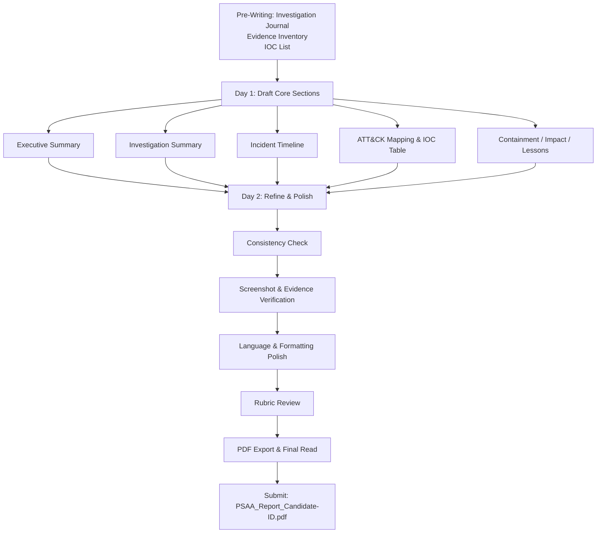
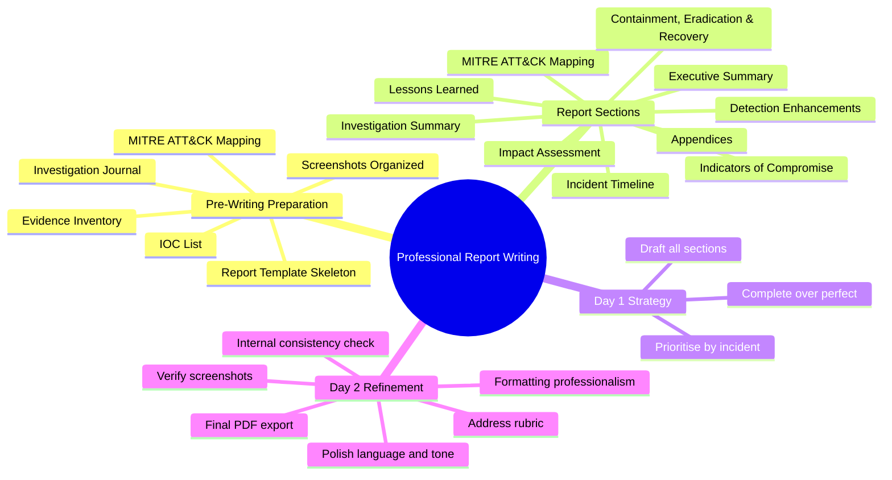

# Two Days of Professional Report Writing

## TCM Exam Objectives

- Craft an executive summary that conveys incident impact to non-technical stakeholders
- Structure a professional incident response report using industry-standard templates
- Document SIEM queries, evidence, and IOCs with proper chain of custody
- Map observed attacker activity to MITRE ATT&CK techniques with supporting evidence
- Prioritise findings and present actionable, risk-ranked recommendations
- Build an accurate incident timeline with UTC timestamps and log source references
- Distinguish between confirmed malicious activity and false positives with justification
- Apply consistent formatting, professional language, and audience-appropriate tone
- Compile appendices containing KQL queries, evidence logs, and closed-incident summaries
- Deliver a complete, polished PDF report within the 48-hour writing window

After 48 hours of intensive log analysis, KQL queries, and incident triage, your technical findings are invisible until you translate them into a polished, professional report. The 48-hour report writing phase is a core, scored deliverable that validates your ability to communicate as a Tier 2 SOC analyst. Your report must demonstrate analytical rigor, speak to multiple audiences, follow industry standards, and reflect professional pride.

- Pre-writing preparation from investigation notes
- Day 1 drafting strategy for the core report
- Day 2 refinement, polishing, and finalisation
- Time management across the 48-hour writing window
- Common pitfalls and how to avoid them





## Pre-Writing Preparation: Bridge from Investigation to Report

Your 48-hour investigation window should end with you ready to write immediately. Build your report structure throughout the investigation.

> 📌 **Exam Tip:** Build your report template skeleton *before* the exam starts. Populate it throughout the 48-hour investigation phase rather than waiting for the writing window. Every screenshot you take and IOC you log during investigation saves 5-10 minutes of report writing time later. Aim to have 70% of your report content drafted in your notes before the writing clock begins.

### What You Must Have Before the Writing Clock Starts

- **Investigation Journal** - Time-stamped log of every action, query, and finding
- **Evidence Inventory** - Spreadsheet mapping evidence IDs to screenshots, CSV exports, and KQL queries
- **IOC List** - Running list of IPs, domains, file hashes with source and confidence
- **MITRE ATT&CK Mapping** - Table of tactics and techniques updated live during investigation
- **False Positive Summaries** - Brief documentation with justification for closed incidents
- **Screenshots Folder** - Organised by incident with clear filenames
- **Report Template** - Pre-built headings and placeholder text

### The Report Template Skeleton

```
[Title Page]
Incident Response Report
Date: [Insert]
Prepared by: [Your Name / Candidate ID]
Classification: Confidential

1. Executive Summary
2. Investigation Summary
3. Incident Timeline
4. MITRE ATT&CK Mapping
5. Indicators of Compromise (IOCs)
6. Containment, Eradication & Recovery Actions
7. Impact Assessment
8. Proposed Monitoring and Detection Enhancements
9. Lessons Learned
10. Appendices
    - A. KQL Queries Used
    - B. Evidence Log
    - C. Closed / False Positive Incidents
```

## Day 1: Drafting the Core Report (First 24 Hours)

### Prioritise by Incident

Choose the most critical 1-3 incidents to document in full detail. For minor alerts or false positives, create a short summary in the appendix.

### Executive Summary

Draft a rough Executive Summary first, then refine at the end. This forces you to articulate the "so what" of the incident.

**Checklist:**
- 2-3 paragraphs maximum
- No technical jargon; imagine a non-technical executive reader
- Answer: What happened? How was it discovered? What was the impact? Is the threat contained? What are the next steps?
- Include a high-level timeline

**Example:**
> On 15 January 2024, the SOC detected an impossible travel alert for user `asmith@corp.com`, who authenticated from Chicago and Moscow within 30 minutes. Investigation confirmed credential compromise: the attacker used a Tor exit node to log in, created a hidden email forwarding rule, and downloaded approximately 50 sensitive files from the Finance SharePoint. Immediate containment disabled the account and revoked all sessions.

### Investigation Summary

This section answers: How did the analyst handle this incident?

- Start with triage: which alert fired, initial assessment
- Describe key queries and why (reference Appendix for full query text)
- Explain how you pivoted from one finding to the next
- Note false leads explored and dismissed
- Conclude with root cause determination

### Incident Timeline

The timeline is the backbone of your report. Use a table with UTC timestamps, event descriptions, log sources, and analyst notes.

| Time (UTC) | Event Description | Log Source | Analyst Notes |
|------------|-------------------|------------|---------------|
| 08:10 | Successful login from Chicago | SigninLogs | User's regular location |
| 08:15 | Successful login from Moscow (Tor IP) | SigninLogs | Impossible travel; threat intel match |
| 08:20 | Inbox rule created, forwarding externally | OfficeActivity | Email exfiltration pivot point |
| 08:25 | 50 files downloaded from SharePoint | OfficeActivity | Mass data collection |

### MITRE ATT&CK Mapping

A mandatory table mapping observed activities to adversary techniques.

| Tactic | Technique ID | Technique Name | Observed Activity | Evidence |
|--------|-------------|----------------|-------------------|----------|
| Initial Access | T1078 | Valid Accounts | Successful login with stolen credentials | SigninLogs (Fig 3) |
| Collection | T1114.002 | Email Collection: Inbox Rules | Inbox rule forwarding externally | OfficeActivity (Fig 5) |
| Collection | T1530 | Data from Cloud Storage Object | Bulk file downloads from SharePoint | OfficeActivity (Fig 6) |
| Exfiltration | T1048.003 | Exfiltration to Cloud Storage | Files downloaded to attacker's location | OfficeActivity (Fig 6) |

<details>
<summary>🔧 Handling Technique Uncertainty</summary>

If a sub-technique is not perfectly clear, use the parent technique and note "sub-technique unconfirmed due to log limitations." For example, if you see PowerShell execution but cannot confirm whether it was T1059.001 (PowerShell) or a specific sub-technique, use T1059 (Command and Scripting Interpreter) and note the limitation. This demonstrates analytical honesty while still providing ATT&CK context.

</details>

### Indicators of Compromise

Present a clean table that the SOC can export for blocking or hunting.

| IOC | Type | Context | Confidence | Source |
|-----|------|---------|------------|--------|
| `185.220.101.34` | IPv4 | Tor exit node used for malicious login | High | Microsoft Threat Intelligence |
| `evil@gmail.com` | Email address | Forwarding destination | High | OfficeActivity |
| `asmith@corp.com` | User account | Compromised user account | Confirmed | SigninLogs |

### Containment, Eradication & Recovery Actions

Use sub-headings for each phase:

**Containment (Immediate):**
- Disable user via `Set-AzureADUser -AccountEnabled $false`
- Revoke all sessions: `Revoke-AzureADUserAllRefreshToken`
- Block attacker IP at perimeter firewall and Conditional Access

**Eradication:**
- Delete inbox rule using `Remove-InboxRule`
- Remove OAuth app grants
- Reset password and enforce MFA

**Recovery:**
- Re-enable account only after password reset and MFA enrollment
- Review externally shared files and revoke access
- Monitor account for 14 days with heightened logging

### Impact Assessment

Quantify if possible. "Approximately 50 files were downloaded from the Finance SharePoint folder. The files contained quarterly financial reports and employee salary data, representing a moderate data confidentiality breach. No customer data or PII was confirmed exfiltrated. One user account affected. No system downtime."

### Proposed Monitoring and Detection Enhancements

Choose 3-5 high-impact recommendations directly addressing gaps the incident exposed:

| Priority | Recommendation | Justification |
|----------|---------------|---------------|
| High | Enable MFA for all users | Would have blocked attacker even with stolen credentials |
| High | Create Sentinel rule for inbox forwarding | Detected similar compromise in near real-time |
| Medium | Block Tor exit nodes via Conditional Access | Attacker used Tor to anonymise login |
| Medium | Enable PowerShell script block logging | Would capture encoded command execution |

### Lessons Learned

- **What went well:** The Sentinel impossible travel rule detected the anomaly in near real-time
- **What could be better:** The account lacked MFA. Email forwarding detection rule was not in place

### Appendices

- **Appendix A - KQL Queries Used:** Every significant query with purpose, full text, and time run
- **Appendix B - Evidence Log:** Table mapping evidence IDs to filenames and descriptions
- **Appendix C - False Positive / Closed Incidents:** Short table with one-line reasons

## Day 2: Refining, Polishing, and Finalising (Second 24 Hours)

### Internal Consistency Check

- **Timeline vs. Narrative:** Does the timeline match what is described in the investigation summary? Are times consistent? (Always use UTC.)
- **Evidence References:** Each claim should point to a specific evidence ID or figure number
- **IOC Table:** Every IOC listed must be mentioned elsewhere in the report

### Verify Screenshots and Figures

- Every screenshot must have a caption
- Ensure screenshots are readable (do not shrink too much)
- All screenshots should be referenced at least once in the report body

### Language and Tone Polish

- Executive Summary: Read it aloud. Does it make sense to a non-technical reader?
- Technical Sections: Use precise, correct terminology
- Consistency: Use the same name for the same entity throughout

### Formatting Professionalism

| Element | Standard |
|---------|----------|
| Headings | Clear hierarchy (H1, H2, H3) |
| Tables | Consistent style with bold headers |
| Fonts | Calibri, Arial, or Times New Roman, 11-12pt |
| Page numbers | Include with report title in footer |
| Spelling/Grammar | Full spell-check before finalising |

### Address the PSAA Rubric

- All critical incidents analysed with full detail
- False positives documented with justification
- Evidence supports conclusions
- Report is logically structured and easy to follow
- Recommendations are actionable and prioritised
- Language is appropriate for the audience
- Formatting is clean and consistent

### Final Review and PDF Export

- Read the entire report from start to finish as the exam evaluator
- Double-check the appendix for completeness
- Export to PDF; verify it renders correctly (especially screenshots)
- Name professionally: `PSAA_Report_Candidate[ID].pdf`

> 📌 **Exam Tip:** The PSAA rubric awards significant points for formatting consistency, language tone, and evidence traceability. On Day 2, spend at least 30 minutes using only the rubric as a checklist against your report. Tick off every criterion: complete executive summary, all incidents analysed, false positives justified, evidence referenced, recommendations prioritised. A report that scores 95% on technical content but has formatting errors or missing appendices may still fail.

## Time Management During the 48-Hour Writing Window

| Task | Suggested Time | Notes |
|------|----------------|-------|
| Organise notes and set up template | 1-2 hours | Start immediately after investigation ends |
| Draft Executive Summary and Investigation Summary | 3-4 hours | Core narrative; refine later |
| Build Timeline, ATT&CK, IOC tables | 4-6 hours | Tables take time; use investigation notes |
| Write Containment, Impact, Lessons, Recommendations | 3-4 hours | Flow from the evidence |
| Compile Appendices and Evidence Log | 2-3 hours | Gather queries, screenshot references |
| **Day 1 Total** | ~14-16 hours | Complete first draft |
| Review, consistency check, polish | 4-6 hours | Read entire document, fix issues |
| Final formatting, PDF export, final read | 2-3 hours | Ensure no last-minute errors |
| **Day 2 Total** | ~6-9 hours | Leave buffer for rest |

## Common Pitfalls and Solutions

| Pitfall | Consequence | Solution |
|---------|-------------|----------|
| Missing Executive Summary or technical jargon | Executive cannot understand impact | Write a separate summary; review as non-technical reader |
| Timeline without evidence references | Unsupported claims | Every row references a specific evidence ID |
| IOC table without confidence or source | Useless for action | Always include context and reason for trust |
| Ignoring false positives | Suggests incomplete triage | Add appendix summarising closed incidents |
| Vague containment actions | Operations cannot act | Specify exact tool/command |
| No lessons learned or improvements | Shows lack of proactive mindset | Always include 2-3 concrete recommendations |
| Inconsistent timestamps | Confusion and distrust | Use UTC exclusively and state it clearly |
| Spelling and grammar errors | Unprofessional appearance | Run spell-check, then read aloud |
| Poor screenshot quality | Evidence useless | Use full-screen captures with query bar visible |

## Sample Report Structure

1. **Title Page**
2. **Table of Contents**
3. **1.0 Executive Summary**
4. **2.0 Investigation Summary**
5. **3.0 Incident Timeline**
6. **4.0 MITRE ATT&CK Mapping**
7. **5.0 Indicators of Compromise**
8. **6.0 Containment, Eradication & Recovery**
9. **7.0 Impact Assessment**
10. **8.0 Proposed Monitoring and Detection Enhancements**
11. **9.0 Lessons Learned**
12. **Appendix A - KQL Queries**
13. **Appendix B - Evidence Log**
14. **Appendix C - Closed / False Positive Incidents**

## Full Worked Report Examples

The PSAA exam requires you to translate raw investigation notes into a polished report. Below are three worked examples covering common exam incident types. Use these as templates for your own writing.

### Example 1: Credential Compromise / Impossible Travel

**Scenario Key Facts:**
- Alert: Impossible travel for `asmith@corp.com` (Chicago → Moscow, 30 min)
- Sign-in from Tor exit node `185.220.101.34`
- Inbox rule created forwarding all mail to `evil@gmail.com`
- 53 files downloaded from Finance SharePoint in 7 minutes
- Account lacked MFA

**1.0 Executive Summary**

> On 15 January 2024 at 08:10 UTC, the SOC detected an impossible travel alert for user `asmith@corp.com`, who authenticated from Chicago and subsequently from Moscow (Tor exit node `185.220.101.34`) within 30 minutes. Investigation confirmed credential compromise. The attacker created a hidden inbox rule to forward email externally and downloaded 53 sensitive financial documents from SharePoint. Immediate containment disabled the account and revoked all sessions. No evidence of lateral movement or persistent access was found. Recommendations include enforcing MFA for all users and deploying a Sentinel detection rule for inbox forwarding.

**3.0 Incident Timeline (Partial)**

| Time (UTC) | Event Description | Log Source | Analyst Notes |
|---|---|---|---|
| 08:10:22 | Successful login from Chicago, IL | SigninLogs | User `asmith@corp.com`, IP 74.12.34.56, regular location |
| 08:15:41 | Successful login from Moscow, RU | SigninLogs | IP 185.220.101.34 (Tor exit node), impossible travel |
| 08:20:14 | Inbox rule "ForwardToExternal" created, forwards to `evil@gmail.com` | OfficeActivity | Email exfiltration pivot |
| 08:22–08:29 | 53 files downloaded from Finance SharePoint | OfficeActivity | Total ~120 MB, including Q4_Financial_Report.xlsx |
| 08:35:00 | Account disabled by SOC | Manual action | `Update-MgUser -AccountEnabled:$false` |
| 08:36:00 | All sessions revoked | Manual action | `Revoke-MgUserSignInSession` |

**4.0 MITRE ATT&CK Mapping**

| Tactic | Technique ID | Technique Name | Observed Activity | Evidence Ref |
|---|---|---|---|---|
| Initial Access | T1078 | Valid Accounts | Login with stolen credentials | SigninLogs (Fig 3) |
| Collection | T1114.002 | Email Collection: Inbox Rule | Rule forwarding to external address | OfficeActivity (Fig 4) |
| Collection | T1530 | Data from Cloud Storage | Bulk SharePoint downloads | OfficeActivity (Fig 5) |
| Exfiltration | T1048.003 | Exfiltration to Cloud Storage | Files downloaded to attacker's cloud | OfficeActivity (Fig 5) |

**5.0 Indicators of Compromise**

| IOC | Type | Value | Context |
|---|---|---|---|
| IOC-001 | IPv4 | `185.220.101.34` | Tor exit node, malicious login source |
| IOC-002 | Email | `evil@gmail.com` | Exfiltration destination address |
| IOC-003 | Account | `asmith@corp.com` | Compromised user account |

### Example 2: Malware Infection / C2 Beaconing

**Scenario Key Facts:**
- Alert: Outbound connection to known-bad IP `203.0.113.55` from `DESKTOP-WIN10`
- User `jdoe` received phishing email with `invoice.docm` attachment
- Macro executed PowerShell download cradle spawning `svchost_updater.exe`
- C2 beaconing every 60 seconds to `203.0.113.55:443`
- Registry Run key added for persistence

**1.0 Executive Summary**

> On 22 February 2024, Microsoft Sentinel alerted on outbound C2 beaconing from endpoint `DESKTOP-WIN10` (user: `jdoe@corp.com`) to known-malicious IP `203.0.113.55`. Investigation traced the infection to a phishing email containing `invoice.docm`. The macro executed a PowerShell download cradle that wrote `svchost_updater.exe` to `C:\Users\jdoe\AppData\Local\Temp\` and established persistent C2 communication. Persistence via `HKCU\...\Run\WindowsUpdate`. The host was isolated within 12 minutes of alert. No lateral movement was detected. Recommendations include blocking PowerShell download cradles via ASR rules and deploying a Sigma rule for the observed mutex `Global\WinUpdMutex`.

**3.0 Incident Timeline (Partial)**

| Time (UTC) | Event Description | Log Source | Analyst Notes |
|---|---|---|---|
| 10:15:00 | Phishing email `invoice.docm` delivered to jdoe | Email gateway | Sender: `billing@external-billing.co` |
| 10:16:30 | Macro execution: `WINWORD.EXE` spawns `powershell.exe` | Sysmon EID 1 | Parent PID correlation |
| 10:16:35 | PowerShell download cradle: `svchost_updater.exe` written to Temp | Sysmon EID 11 | File creation event |
| 10:17:00 | First C2 beacon to `203.0.113.55:443` | Sysmon EID 3 | Repeat every 60s |
| 10:17:10 | Registry Run key created | Sysmon EID 13 | `HKLM\...\Run\WindowsUpdate` |
| 10:29:00 | Host isolated by SOC via Microsoft Defender for Endpoint | Manual action | Network isolation |

**4.0 MITRE ATT&CK Mapping**

| Tactic | Technique ID | Technique Name | Observed Activity | Evidence Ref |
|---|---|---|---|---|
| Initial Access | T1566.001 | Spearphishing Attachment | `invoice.docm` sent to jdoe | Email gateway log (Fig 2) |
| Execution | T1059.001 | PowerShell | Macro spawns powershell.exe | Sysmon EID 1 (Fig 3) |
| Persistence | T1547.001 | Registry Run Keys / Startup Folder | `WindowsUpdate` Run key | Sysmon EID 13 (Fig 4) |
| C2 | T1071.001 | Web Protocols | HTTPS beacon to 203.0.113.55:443 | Sysmon EID 3 (Fig 5) |

### Example 3: Insider Threat / Data Exfiltration

**Scenario Key Facts:**
- Alert: Employee `bwilson` downloaded 500+ files from HR SharePoint in 1 hour
- Activity occurred at 01:00–02:00 UTC (outside working hours)
- Files copied to personal OneDrive then accessed from home IP
- User resigned 2 days prior — termination not yet processed

**1.0 Executive Summary**

> On 10 March 2024 at 01:00 UTC, Microsoft Sentinel alerted on anomalous file access by user `bwilson@corp.com`, who downloaded 534 files from the HR SharePoint site within one hour. The employee had resigned 48 hours earlier but still retained system access. The user copied files to personal OneDrive and accessed them from a home ISP IP address. The activity matched a known data-exfiltration pattern (T1530, T1048). Account access was suspended at 01:45 UTC. Approximately 200 files containing employee PII were confirmed exfiltrated. Recommendations include implementing a terminated-employee offboarding playbook and deploying a bulk-download Sentinel detection rule.

**5.0 Indicators of Compromise**

| IOC | Type | Value | Context |
|---|---|---|---|
| IOC-001 | Account | `bwilson@corp.com` | Terminated employee, 534 files downloaded |
| IOC-002 | IP | `98.76.54.32` | Home ISP, unauthorized post-termination access |
| IOC-003 | URL | `https://corp-my.sharepoint.com/personal/bwilson` | Exfiltration source site |

**6.0 Containment, Eradication & Recovery**

| Phase | Action | Command / Method |
|---|---|---|
| Containment | Disable user account | `Update-MgUser -UserId bwilson@corp.com -AccountEnabled:\$false` |
| Containment | Revoke all sessions | `Revoke-MgUserSignInSession -UserId bwilson@corp.com` |
| Eradication | Remove personal OneDrive sync | Revoke OAuth app consent for personal account |
| Recovery | Enable account for IT-managed data transfer only | Limited access with 24-hour expiry |

## Recap

The 48-hour report writing phase is equally as critical as the investigation phase. Day 1 focuses on drafting all report sections from investigation notes—Executive Summary, Investigation Summary, Incident Timeline, ATT&CK Mapping, IOC Table, Containment/Eradication/Recovery, Impact Assessment, Detection Enhancements, and Lessons Learned. Day 2 refines and polishes: consistency checks, screenshot verification, language polish, formatting, and final PDF export. The report skeleton should be created before the exam and populated throughout the investigation phase to ensure a smooth transition.
